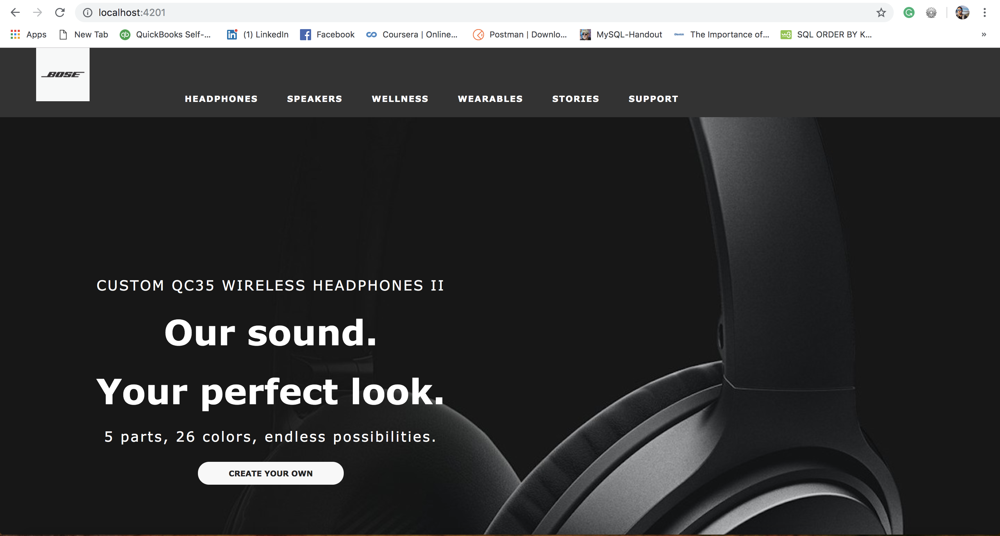

# Site Rebuild

_Published_  3/29/2019  
_Author_ **Gary Bermudez**

# Description:

On this project, I will be rebuilding the homepage of the Bose website [Bose Homepage](https://www.bose.com/en_us/index.html). The homepage will be divided into the following components:

* Header: top navigation menu
* Hero Image
* Recommended: products
* Bose Home
* Bose Noise
* Sunglasses
* BOSE AUTOMOTIVE
* Footer: Social Media
* Footer: Sign up form
* Footer Links
This project was generated with [Angular CLI](https://github.com/angular/angular-cli) version 1.6.5.

### Here are some screen capture of the buildout version:

### Setup/Installation Requirements

###Cloning the Github repository (Mac OSX):
* Open the Terminal in your computer
* Make sure you're in your Desktop directory
* Clone the repository
* In your Terminal, navigate to the project doctor-lookup
* Run `npm install` in the terminal to install dependencies
* Tun `ng serve` in the terminal to build and start the dev server

### Known Bugs

* The site needs to be refresh in order to make a new search.

### Technologies Used
* HTML
* CSS
* Angular

## Support and contact details

_Email garybm.17@gmail.com with any questions._

## License

This software is licensed under the MIT license.

Copyright (c) 2018 **Gary Bermudez**
