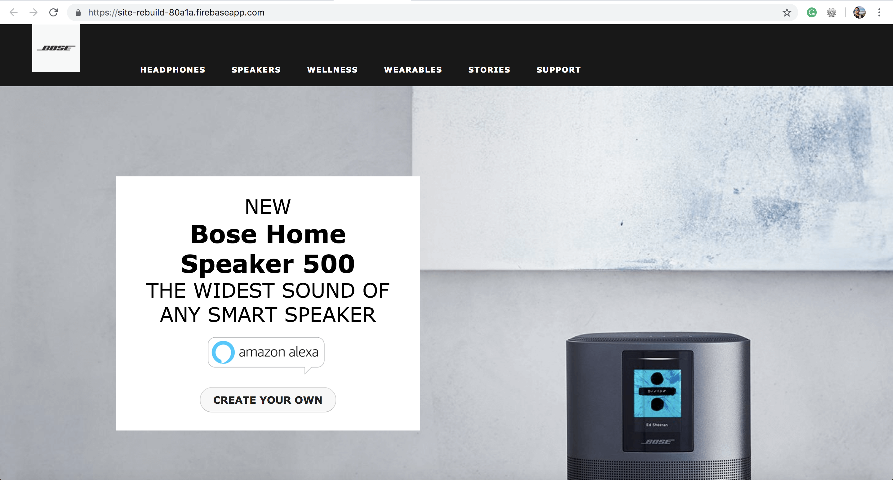

# BOSE Site Rebuild

_Published_  3/29/2019  
_Author_ **Gary Bermudez**

# Description:

On this project, I will be rebuilding the homepage of the Bose website [Bose Homepage](https://www.bose.com/en_us/index.html). The homepage will be divided into the following components:

* Header: top navigation menu
* Hero Image
* Recommended: products
* Bose Home (not ready)
* Bose Noise (not ready)
* Sunglasses (not ready)
* BOSE AUTOMOTIVE (not ready)
* Footer: Social Media (not ready)
* Footer: Sign up form (not ready)
* Footer Links (not ready)
This project was generated with [Angular CLI](https://github.com/angular/angular-cli) version 1.6.5.

### Screen captures of the buildout version:

## Setup/Installation Requirements

#### Prerequisites
* npm package manager
* Angular CLI
* Node.js

#### Cloning the Github repository (Mac OSX):
* Open the Terminal in your computer
* Make sure you're in your Desktop directory
* Clone the repository `git clone`: https://github.com/garybm/site-rebuild
* In your Terminal, navigate to the project site-rebuild
* Run `npm install` in the terminal to install dependencies
* Run `ng serve --open` in your terminal: The ng serve command launches the server. The --open (or just -o) option automatically opens your browser to http://localhost:4200/.

### Known Bugs

* Media queries have not been applied, the site is currently available only on Desktop view.

### Technologies Used
* HTML
* CSS
* Angular
* Typescript

## Support and contact details

_Email garybm.17@gmail.com if you have any questions_

## License

This software is licensed under the MIT license.

Copyright (c) 2018 **Gary Bermudez**
